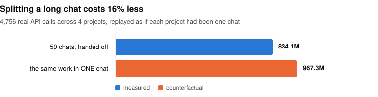
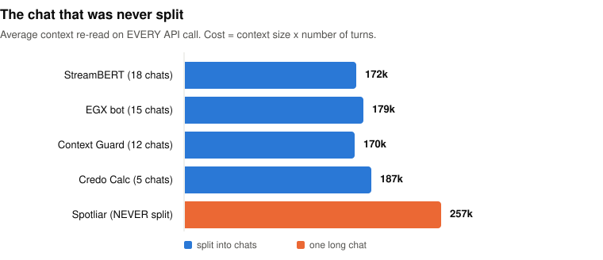
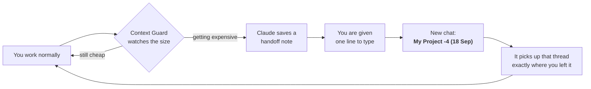

<h1 align="center">Save Claude Tokens with Context Guard</h1>

<p align="center">
  <em>Long Claude Code chats get expensive quietly.<br>
  Context Guard measures the real bill, refuses to let your work evaporate, and hands the next chat everything it needs.</em>
</p>

<p align="center">
  
  
  
  
  
</p>

---

## The problem, in one sentence

**Every reply re-reads the entire conversation.** A turn at 316k tokens costs roughly **4×**
the same turn at 73k — and you pay that again on *every* message, for the rest of the chat.

So the fix is to work in shorter chats. Except nobody does, because starting a new chat
means losing everything the old one knew. Context Guard removes that trade-off.

---

## Does it actually save anything?

Measured on one real account's own transcripts — **64 sessions, 668 MB** — not on a benchmark.

Four project threads were run as **50 separate chats**, handing off between them. Replaying
those same **4,756 API calls** as if each thread had been one long chat instead:

<picture>
  <source media="(prefers-color-scheme: dark)" srcset="docs/chart-savings-dark.svg">
  
</picture>

Splitting is **not free** — each new chat re-pays about **72k tokens** of system prompt, tool
definitions and memory before you type a word. It still wins, because a long chat's cost
grows with the *square* of its length and only linearly across short ones.

The blunter evidence is the one thread that was **never** split:

<picture>
  <source media="(prefers-color-scheme: dark)" srcset="docs/chart-percall-dark.svg">
  
</picture>

That single chat made **10,775 API calls**, peaked at **824k**, auto-compacted **54 times**
(all 50 split chats managed **8** between them), and burned **2,771.9M** tokens on its own —
more than triple all fifty split chats combined.

> **Two honest caveats.** The 16% model caps the merged chat at its auto-compact point, so it
> is a **floor**, not a headline. And the un-split thread was doing heavier work, so read
> 257k vs 175k as a strong correlation, not a controlled trial.

---

## What you actually do



You type the label. Everything else is automatic — and if a chat ends without anyone
writing a note, the guard writes a mechanical one anyway so the thread is never lost.

---

## How it works

| hook | fires on | what it does |
|---|---|---|
| `audit.py --alert` | SessionStart | flags sessions whose size × age make them expensive to resume, and delivers a waiting handoff note |
| `guard.py --size` | UserPromptSubmit | measures live context, warns at escalating levels, and at the top orders a full handoff note |
| `guard.py --reread` | PreToolUse (Read) | stops the same image being read into context twice |
| `guard.py --bash` | PreToolUse (Bash) | blocks heredocs, which mangle file content on Windows |
| `guard.py --ledger` | Stop | appends your own words to a permanent ledger, writes a stub note if none exists, and past the ceiling refuses to let the chat close |

Three ideas do the real work.

**The ledger.** Every message you send is appended to one file per project, and never
edited. When a new chat picks up a thread it is handed *your own words, verbatim* —
including requests from ten chats ago that were never delivered. Summaries lose exactly
the detail that makes a request actionable.

**The ceiling.** Warnings alone do not retire a chat; one chat here ran 524 turns straight
through repeated warnings. So past a hard ceiling the Stop hook simply refuses to let the
chat close until the note is on disk. It checks the **file**, not a claim — an assistant
saying "I saved it" cannot satisfy it. The ceiling is derived from your own
`autoCompactWindow`, so it always sits *below* the point the app compacts at.

**The stub.** A ceiling only helps chats that reach it, and most never do — one chat here
ran 19 hours, peaked at 132k, and so was never once asked for a note. Its thread became
unresumable. Now every chat that closes without a real note gets a mechanical one:
session id, context, transcript path, ledger path, last checkpoint. It says plainly in its
own text that it records *what* and *where* and cannot record *why* — and it can never
overwrite a note a human actually wrote.

---

## Install

```bash
git clone https://github.com/Masry-code/context-guard.git
cd context-guard
python install.py --dry-run
```

That prints exactly what would change in `~/.claude/settings.json` and writes nothing. When
you are happy:

```bash
python install.py
```

It **merges** — your own hooks and settings are left alone, it backs the file up with a
timestamp first, and running it twice is a no-op. To reverse it:

```bash
python install.py --uninstall
```

Then restart Claude Code. Python 3.8+, nothing to `pip install`.

---

## Using it

When a chat gets expensive, Claude saves a note and tells you one line to type:

> open a new chat here and just say: **My Project -4 (18 Sep)**

Open a new chat in the same folder, type that, and it picks up precisely that thread — the
note, your unfulfilled requests, the traps, the decisions. The `-4` is a running number so
the order is visible in your sidebar. Several projects can share a folder; the label is how
you summon one specifically, and the others stay waiting.

### Away mode

If you are away from your computer and answering from the Claude mobile app, you *cannot*
open a new chat — so being told to is useless noise. Type:

```
afk
```

…and Context Guard keeps **saving** notes exactly as before but stops telling you to start a
new session. Type `back` or `afk off` when you return — both work.

It is deliberately explicit: the whole message must be the phrase, so a sentence that merely
*mentions* being afk will not arm it. A guard that switches itself off without telling you is
worse than no guard.

The flag is machine-wide and does not expire, so the next chat you open says so once:

> ⏸ Away mode is ON (since 18 Sep 20:30) — notes are still being saved, but nothing will ask
> you to open a new chat. Type `back` or `afk off` to resume normal prompts.

### Commands you can run yourself

| command | safe by hand? |
|---|---|
| `guard.py --report` | yes — prints what it knows, writes nothing |
| `guard.py --skills` | yes — counts repeated command patterns |
| `guard.py --checkpoint <session-id> "<text>"` | yes — records a milestone |
| `guard.py --attribute` | yes — backfills ledger attribution |
| `ledger-budget.py [project-key]` | yes — prints what the request budget keeps and drops |
| `guard.py --size` / `--ledger`, `audit.py --alert` | **no** — hook entry points with side effects, including consuming a handoff note |

**Run `--attribute` before `ledger-budget.py`.** Entries written before the chat id went
inline know whose thread they belong to only through the `.attrib.json` sidecar that
`--attribute` builds. Without it the budget tool sees a smaller ledger than the pickup
path does and will happily tell you the budget is fine when it is not — measured here on
19 Sep 2026, 399 of 505 attributed requests were invisible to it. It now prints how many
it recovered, and says so when the answer is none.

### Turning bits off

Create an empty file in `~/.claude/context-guard/`:

* `no-ceiling` — stop the Stop hook ever blocking
* `no-memory-nag` — stop it checking that memories were written
* `no-heredoc-guard` — allow heredocs again (or put `# heredoc-ok` in a single command)

Every automatic behaviour has an override. That is deliberate: a check you cannot switch off
is a check you will eventually disable by deleting the whole tool.

---

## Tests

```bash
python test_guard.py
```

**412 checks, no test framework required.** They run against a throwaway home directory, so
they cannot touch your real notes — which is worth stating plainly, because until
18 Sep 2026 that was only true on Windows. On macOS and Linux `expanduser("~")` falls back to
the passwd database when `HOME` is missing, so the suite would have written into the real
`~/.claude/handoff` and renamed the notes it found there.

> Built test-first throughout. The stub feature broke **8 passing tests** the moment it
> landed, because two places treated *"a note file exists"* as *"this chat handed off"* — so
> writing a stub every turn would have silently disabled the ceiling. The tests caught it;
> the design did not.

---

## What it does not do

* It does not make Claude cheaper per token. It stops you paying for context you no longer need.
* It does not clear a session. `clear_session` was measured as inert in this build — it
  reports success and the chat carries straight on.
* It does not send anything anywhere. Every file it writes is under your own `~/.claude/`.
* It cannot resume a chat *for* you. You still type the label.
* It has only ever been run on Windows. The cross-platform defect above is fixed and tested
  both ways, but never executed on a real macOS or Linux machine — reports welcome.

---

## License

MIT — see [LICENSE](LICENSE).

---

Made by **Masry inc.**

*For Reva — you are my muse, my wife, and my everything.*
